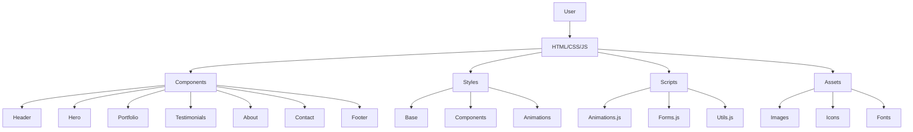
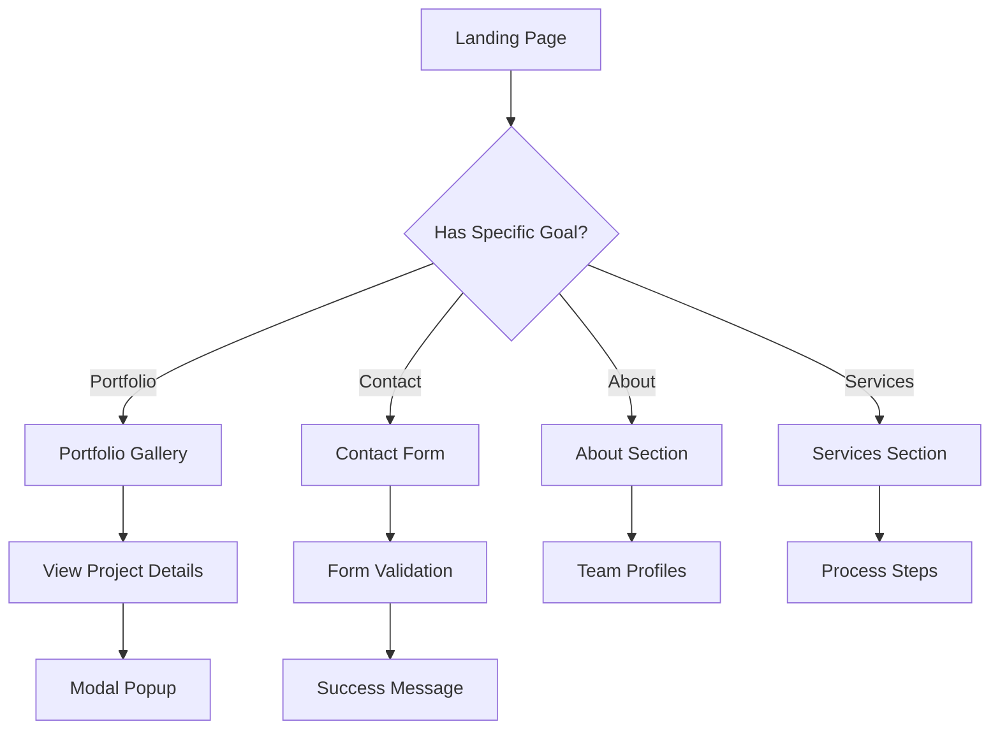

# Pixievie Studio Premium Agency Upgrade Specification

## Overview
This document outlines the comprehensive upgrade plan for Pixievie Studio's website to elevate it to premium agency standards while maintaining the existing purple theme. The upgrade focuses on enhanced user experience, modern design elements, interactive features, and performance optimizations.

## Current State Analysis
- **Structure**: Single-page layout with hero, services, featured work (single project), process, CTA, and footer
- **Design**: Purple color scheme (#805ad5), Inter font, basic CSS grids, minimal animations
- **Functionality**: Static content, no interactive elements beyond hover effects
- **Content**: Limited portfolio (1 item), no testimonials, team info, or contact form
- **Performance**: Basic HTML/CSS/JS, no optimizations

## Enhanced Layout Structure

### Navigation Bar
- **Fixed header** with logo, navigation links (Home, About, Portfolio, Services, Contact)
- **Mobile-responsive** hamburger menu
- **Smooth scroll** to sections
- **Active link highlighting**

### New Sections
1. **Portfolio Gallery**
   - Grid layout with filterable categories (Web, Design, Architecture)
   - Lightbox/modal for project details
   - Infinite scroll or pagination for scalability

2. **Testimonials**
   - Carousel/slider with client quotes and photos
   - Star ratings and company logos
   - Auto-play with pause on hover

3. **About Section**
   - Team member profiles with photos and bios
   - Company story and values
   - Mission statement

4. **Contact Form**
   - Multi-field form with validation
   - Integration with backend service (e.g., Formspree, Netlify Forms)
   - Success/error messaging

### Footer Improvements
- **Multi-column layout**: Links, social media, contact info, newsletter signup
- **Copyright and legal links**
- **Back-to-top button**

## Visual Design Upgrades

### Color Scheme Enhancement
- **Primary**: Deep purple (#6B46C1) to rich purple (#553C9A)
- **Secondary**: Light purple accents (#E9D8FD)
- **Gradients**: Subtle purple-to-blue gradients for backgrounds
- **Neutral**: Enhanced grays for text hierarchy

### Typography
- **Font Stack**: Inter (existing) with fallbacks
- **Hierarchy**: H1-H6 with consistent sizing and weights
- **Line Heights**: Optimized for readability (1.4-1.6)
- **Letter Spacing**: Subtle adjustments for modern feel

### Icons and Graphics
- **Icon Library**: Lucide React or Heroicons for consistency
- **Illustrations**: Custom SVG illustrations for services/process
- **Brand Elements**: Consistent logo usage and favicon

### Animations and Effects
- **Scroll-triggered animations**: Fade-in, slide-up using Intersection Observer
- **Hover effects**: Scale, color transitions, shadows
- **Loading animations**: Skeleton screens, progress bars
- **Micro-interactions**: Button presses, form feedback

## Interactive Features

### Scroll Animations
- **Library**: AOS (Animate On Scroll) or custom Intersection Observer
- **Triggers**: Elements animate as they enter viewport
- **Performance**: Optimized with will-change and transform properties

### Modal Popups
- **Portfolio Details**: Click project to open modal with full description, images, tech stack
- **Contact Form**: Inline modal or slide-out panel
- **Image Gallery**: Lightbox with navigation

### Form Validation
- **Real-time validation**: HTML5 + JavaScript
- **Error states**: Clear messaging and visual indicators
- **Success feedback**: Confirmation animation and message

### Additional Interactions
- **Smooth scrolling** navigation
- **Parallax effects** on hero background
- **Interactive process steps** with hover reveals

## Content Additions

### Portfolio Items
- **Minimum 6-8 projects** across categories
- **Project structure**: Title, description, images, tech stack, live link, case study
- **High-quality images**: Optimized WebP format

### Client Testimonials
- **5-7 testimonials** with photos, names, companies, quotes
- **Diverse industries**: Web, design, architecture clients

### Team Information
- **Founder/Developer profiles**: Photos, bios, specialties
- **Contact details** and social links

### Additional Content
- **Blog section** (future expansion)
- **FAQ section**
- **Privacy policy and terms**

## Performance Optimizations

### Image Optimization
- **Formats**: WebP with JPEG fallbacks
- **Lazy loading**: Native loading="lazy" attribute
- **Compression**: Automated via build process

### Code Minification
- **CSS/JS**: Minified and concatenated
- **HTML**: Compressed output
- **Tools**: Webpack, Parcel, or similar bundler

### Caching and Loading
- **Browser caching**: Appropriate cache headers
- **Critical CSS**: Inline above-the-fold styles
- **Font loading**: Font-display: swap

### Monitoring
- **Lighthouse scores**: Target 90+ for all metrics
- **Core Web Vitals**: Optimize LCP, FID, CLS

## Technical Architecture

### Component Structure
```
src/
├── components/
│   ├── Header/
│   ├── Hero/
│   ├── Portfolio/
│   ├── Testimonials/
│   ├── About/
│   ├── Contact/
│   └── Footer/
├── styles/
│   ├── base.css
│   ├── components.css
│   └── animations.css
├── scripts/
│   ├── animations.js
│   ├── forms.js
│   └── utils.js
└── assets/
    ├── images/
    ├── icons/
    └── fonts/
```

### Implementation Approach

#### Phase 1: Foundation
- Set up build system (if not using vanilla)
- Implement navigation and basic layout
- Add new sections structure

#### Phase 2: Design & Content
- Apply visual upgrades
- Add content and images
- Implement animations

#### Phase 3: Interactivity
- Add JavaScript functionality
- Form validation and submission
- Modal systems

#### Phase 4: Optimization
- Performance audits
- Image optimization
- Code minification

#### Phase 5: Testing & Launch
- Cross-browser testing
- Mobile responsiveness
- SEO optimization

## Mermaid Diagrams

### System Architecture


### User Flow


This specification provides a roadmap for transforming Pixievie Studio into a premium agency website. The design maintains the purple theme while incorporating modern web standards and best practices.